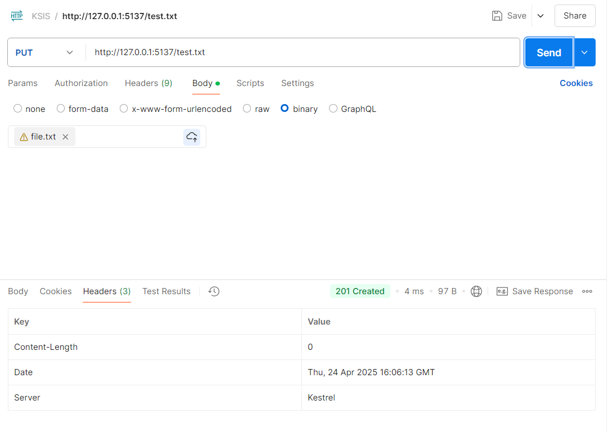
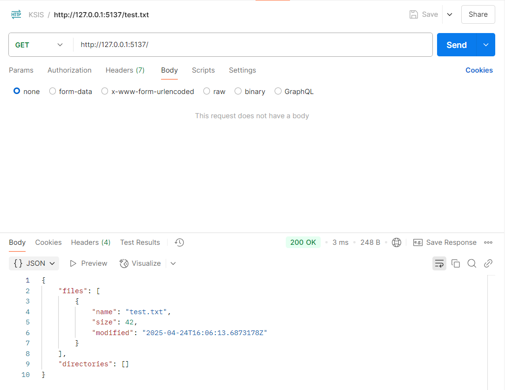
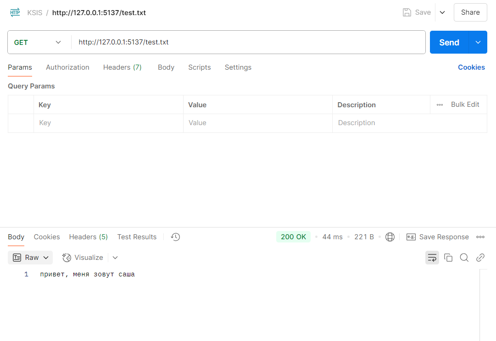
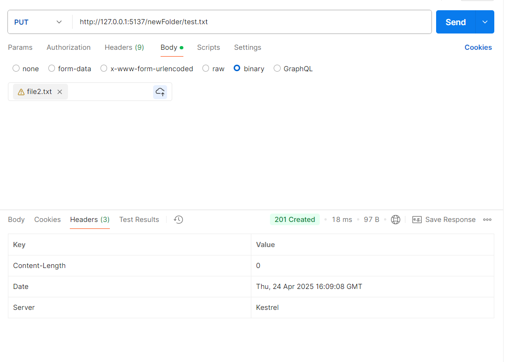
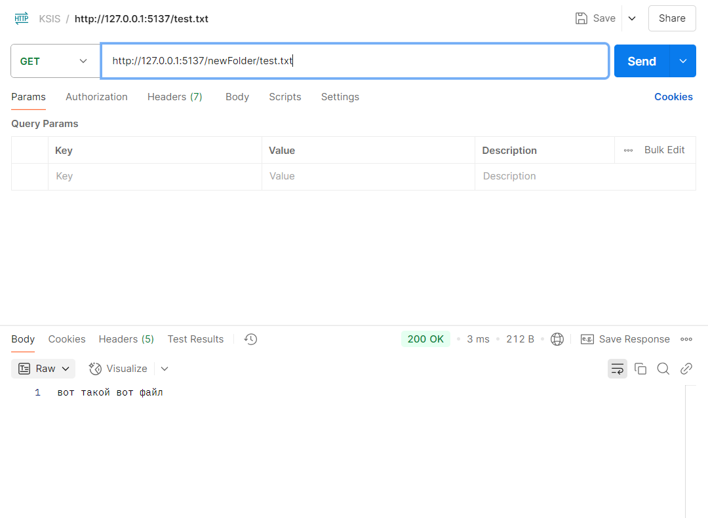
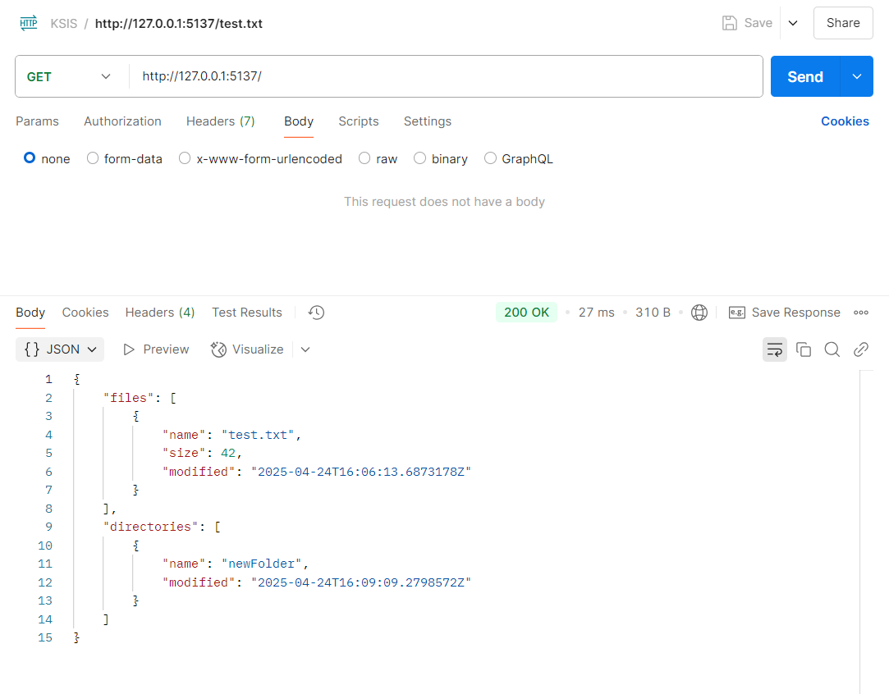
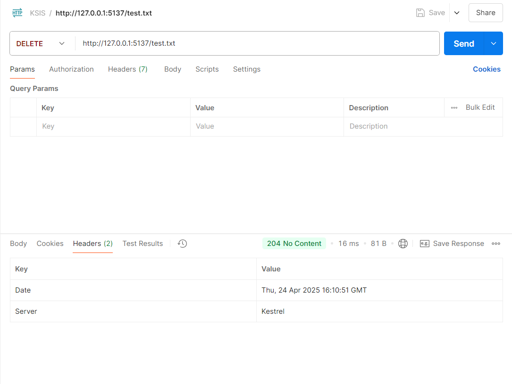
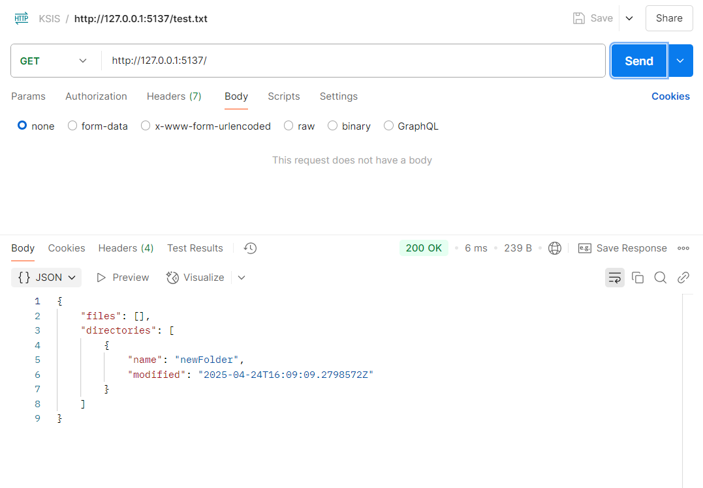

# Скриншоты работы программы

Язык: С#

HTTP-клиент: Postman

Команда PUT с выбранным локальным файлом:

Проверяем наличие файла с помощью команды GET:

Просматриваем содержимое файла (GET):

Добавляем новый файл во вложенную директорию (PUT):

Проверяем наличие файла (GET):

Проверяем наличие новой директории в коренной директории (GET):

Удаляем файл в коренной директории (DELETE):

Проверяем, что файл удален (GET):
